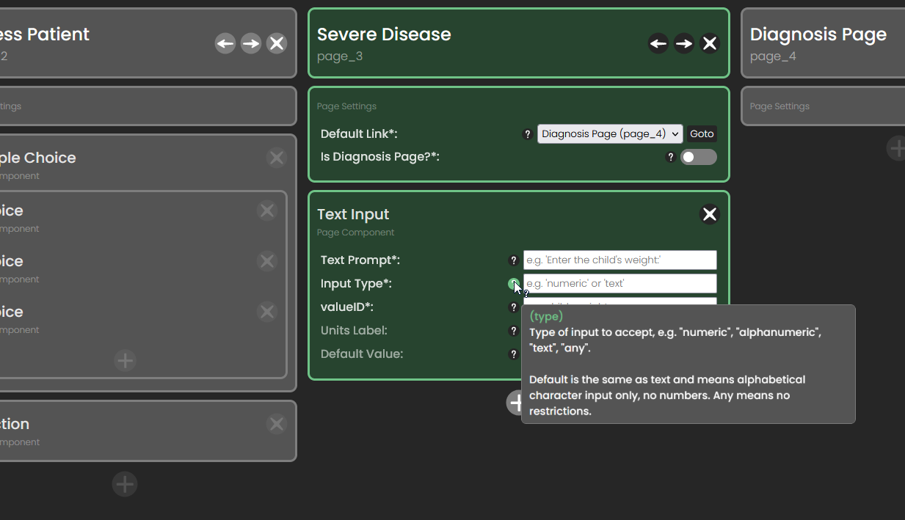

# Usage Overview

It is recommended to use either Chrome or Firefox. While the editor may work with other browsers, only Chrome and Firefox are extensively tested. It is also recommended that you keep this guide document open during the workflow editing process.

## Using the Editor

The basic page setup lays out pages horizontally with their respective components underneath them. Press the plus button on the right hand side to add new pages. Click on a page's header card to edit its properties, or to add, modify, or delete its components. You can also click on a page's name to modify it.

In the bottom right you can find the utility buttons. Hover over these to see their labels. Using these buttons one can import a workflow from a `.json` file or from the server, one can upload their workflow to the server, and the editor's theme can also be changed.

Page order is irrelevant and has no effect on the workflow, it is merely for user convenience. The only exception to this is the first page, which is the entry point for the workflow. Component order does matter, and components can be reordered by drag and drop. They can also be moved to different pages.

In the above image we can see the user hovering a tooltip for more information about what the input type property on the `TextInput` component should be. Notice the wort "type" in parenthesis in the tooltip, this is the *name* of the property. If you wanted more information about this property, this property name in parenthesis is how it would be referred to in this usage document. The "Input Type" label is merely for convenience.

## Branching Logic

Each page automatically will have a "Next" and "Prev" button. The "Prev" button will always return to the previous page. The "Next" button has more complex behavior and is used to create branching logic within a workflow. By default, the "Next" button goes to the page specified by the `defaultLink` property.

There are two ways that the `defaultLink` property can be overwritten: by `MultipleChoice` components and by any type of `LogicComponent`. More information can be found in these components respective sections below, however the general gist is as follows:

`MultipleChoice` can overwritten `defaultLink` if they do not have `multiselect` enabled. Such a `MultipleChoice` component will have a `link` property on each of it's `Choice`s. The `link` of the `Choice` which is selected will overwritten the `defaultLink` of the page when the "Next" button is pressed.

The other way that `defaultLink` can be overwritten is if a `LogicComponent` is triggered. The conditions specified in each of a page's `LogicComponent`s are checked when the "Next" button is pressed. If a `LogicComponent`'s condition is found to be satisfied, then it's `satisfiedLink` will overwrite the page's `defaultLink`.

If *multiple* `LogicComponent`s have their conditions satisfied, the highest LogicComponent on the page will take highest precedence.

## About ValueIDs

This section is *very important* so please read it carefully. ValueIDs are what make this whole thing work. For any component which takes data, whether that be a `TextInput`, `MultipleChoice` or something else, the component must have a `valueID` property. This serves several functions.

A component's `valueID` corresponds to the column of the database where that component's data will go. This means a few things. Firstly, it means that the component's `valueID` should clearly indicate what it is storing. For example a `TextInput` used by the nurses to record a child's age might be called `child_age`. The second implication of this is that `valueID`s should almost *never* be changed! If you are editing a workflow and a piece of data is being collected somewhere on some page with a certain `valueID`, make *absolutely* sure that if you modify the workflow such that the data in quesiton is being collected somewhere else it is still being collected under the same `valueID`. **Failure to do this will result in the creation of a new column in the database, meaning there will now be multiple columns each storing pieces of the same data.** This is extremely undesirable.

To help try and ensure this does not happen, workflow validation will compare your workflow's `valueID`s to the existing database columns, and give you a warning if any would create a new column. When submitting again, you must indicate to override these warnings if you genuinely intend to create a new database column (such as if you are adding some new piece of data to be collected which was not being collected before). Make sure you are absolutely sure that you wish to create new database columns if you are overriding these warnings.

A component's `valueID` is also used to make branching logic work. Specifically, each `LogicComponent` has a `targetValueID`, which is the `valueID` it will look at. This does not need to be a `valueID` on that page, so information from previous pages can affect branching on the current page.

# Component Specifications

**`Page`**

***title***: The title of the page, usually one or two words indicating the purpose of the page.
***pageID***: A unique identifier for the page used for branching logic and page linking.
***defaultLink***: The the next page to go to, barring any logic occuring on the page.
***isDiagnosisPage***: Whether this is the diagnosis page or not.

By default each page has two buttons, "Next" and "Prev". While "Prev" always returns to the page which
linked to this page, the page "Next" sends to may depend on logic in the page. If no logic is triggered,
`defaultLink` is the destination. However, LogicComponents trigger when "Next" is pressed and can override
this `defaultLink`. If there are multiple LogicComponents, tiebreaking if multiple are satisfied is done
based on order (highest on page has highest precedence). 

The diagnosis page is the end of the workflow. This page cannot be customized. It is included in the workflow editor so that it can be linked to, indicating the end of the workflow.

## Page Components

**`Paragraph`** (PageComponent)

***text***: Some paragraph style text content.

A basic element representing a chunk of text on the page. It has a single property, `text`, which is the text content it should display.

**`MediaItem`** (PageComponent)

***fileName***: The file name of the media to display. 
***label***: (optional) Some text caption describing the media.

Another basic element, used to display images or videos within the application. These files must be upload to the application through the ALRITE dashboard. The `fileName` property should be the same file name the uploaded image or video has. The optional `label` property displays a text caption underneath the media.

**`MultipleChoice`** (PageComponent)

***valueID***: A unique identifier for the data collected by this component. 
***label***: A text label, generally a quesiton prompt. 
***multiselect***: Whether multiple options can be selected, or only one.

One of the basic building blocks of any workflow, this component represents both a multiple choice input with radio buttons where only one option can be selected, or a checkbox component where any number of boxes can be selected. If the component has `multiselect` disabled, each `Choice` subcomponent can have a `link` property that can override the `Page`'s `defaultLink` property, however this property is optional. If the component has `multiselect` enabled, then to do branching logic use a `SelectionLogic` component.

**`Choice`** (SubComponent)

***text***: The text this choice displays to the nurse. 
***value***: This can be the same as text, but is what will actually be recorded to the database if this choice is selected. You might want this to be different if some logic is done based on this choice. 
***link***: (optional) The pageID of the `Page` that this choice should link to if selected (not valid if parent has multiselect).

**`TextInput`** (PageComponent)

***valueID***: A unique identifier for the data collected by this component. 
***label***: Text indicating what should be input, generally a question or prompt. 
***type***: Type of input to accept. Valid options include "numeric", "alphanumeric", "text, "any".
Default means alphabetical character input only, no numbers. Any means no restrictions. 
***units***: (optional) If provided, displayed next to the TextInput, e.g. "cm". 
***defaultValue***: (optional) The does not need to start empty. If provided, the component will start with this value filled in already. The type of this should match the property (don't give a `defaultValue` with letters in a numeric `TextInput`).

Another important building block of any workflow, if there is not a designated component specifically for collecting some type of information, `TextInput` can almost always do the trick. 

The `type` property can be a bit confusing, particularly "text, and "any". Text means only character input, while any means any input, including text and numbers (like alphanumeric) but also any other input type. You probably don't need to use "any", it is included for completion purposes.

**`Button`** (PageComponent)

***text***: The button's display text, for example "Skip".
***link***: The pageID of the `Page` this button opens when pressed.
***hint***: (optional) Displayed above button detailing when/why to skip.

This component should almost never be used. Generally, navigating through the workflow should be done via the "Next" (and "Prev") button on each `Page`, which you can manipulate using Logic Components and `MultipleChoice` components. However, if for example you want a certain `Page` to be skipable without the nurse needing to fill out the information, that is a place where `Button` would be useful.

**`Counter`** (PageComponent)

***valueID***: A unique identifier for the data collected by this component. 
***title***: A short word or phrase name for the counter, e.g. "Respiratory Rate". 
***hint***: (optional) Longer text description indicating what is being counted. 
***timeLimit***: How long to count for, given in seconds. 
***offerManualInput***: True or false, whether the counter can be bypassed by directly typing in a value.

## Logic Components

**`ComparisonLogic`** (LogicComponent)

***type***: The type of comparison to be done, valid types include ">", "<", ">=", "<=", "=". The notations ">=" and "<=" mean "greater than or equal to" and "less than or equal to" respectively. 
***targetValueID***: The `valueID` of the component whose value will be compared to the threshold. Will be on the left hand side of the comparison. 
***threshold***: A number that is compared to the `valueID`, this will be on the right hand side of the comparison. 
***satisfiedLink***: The `pageID` of the `Page` to go to if the value satisfies the threshold given the comparison type.

This component is used to do logic with numbers. For example, say a page should lead to one of several different pages based on a child's temperature. We might have a `TextInput` with `valueID` "child_temp" where the child's temperature will be collected in Celsius. Perhaps we want to go to a certain page if the child's temperature is normal, and another page if they have a fever. To accomplish this, we would se the operation `type` to ">", since we want to see if "child_temp" is greater than some threshold. Then, we would set `targetValueID` to "child_temp", and `threshold` to say, 38. Finally, we would set the `satisfiedLink` to the fever page's `pageID`, and have the current page's `defaultLink` be the `pageID` of the normal temperature page.

For a sample workflow showing a (slightly more complex) example of using comparison branching logic, click the link below. It is more easy to digest when it is laid out visually. You will notice in the example that there are multiple `ComparisonLogic` components, and that their order is intentional; it reflects which should have the highest precedence in the case that multiple are satisfied.

http://54.190.44.215:8000/alrite/editor/?workflow=Fever_Logic
    
**`SelectionLogic`** (LogicComponent)

***type***: Valid types include "all_selected", "at_least_one", "exactly_one", "none_selected". 
***targetValueID***: The `valueID` of a `MultipleChoice` component to look at. 
***satisfiedLink***: The `pageID` of the `Page` to go to if the selection satisfies the selection type.

**`ValidationLogic`** (LogicComponent)

***type***: The type of comparison to be done, valid types include ">", "<", ">=", "<=", "=". The notations ">=" and "<=" mean "greater than or equal to" and "less than or equal to" respectively. 
***targetValueID***: The `valueID` of the component whose value will be compared to the threshold. Will be on the left hand side of the comparison. 
***threshold***: A number that is compared to the `valueID`, this will be on the right hand side of the comparison.

Unlike the above two logic components, `ValidationLogic` components are not used to create branching but rather for input validation. By default, all input components are required before "Next" can be pressed. However, to validate said inputs this component is necessary. 

If the expression described by a `ValidationLogic` component is satisfied, the page's "Next" button will be disabled, just like it would be if an input component on the page was not filled out. Like with other logic components, multiple `ValidationLogic` components can be used on the same page, and the `valueID`s they target do not need to necessarily correspond to components on that page.

# Making Changes

## Running Locally

Run `tsc npx -w` to tell the TypeScript compiler to watch for changes. Then, open index.html in the browser. Any changes you make the the HTML, CSS or TypeScript should be updated on refresh.

If working with the server, run `python manage.py runserver`, and make sure you are editing the subcomponent alrite editor found in the `static` folder. Otherwise, you will have to push and pull every time you want the server to reflect your changes.

## Adding Components

* Create an interface and documentation object for the component in `components.ts`
* Add an option to the new page component (id "template-new-component") in `index.html`
* Create a template of the component in `index.html`
  * Look through existing components and the related code to make sure you understand how everything works first
  * Copy another similar component type for the structure
  * Notice how props are done: the class of the input, select or textarea is very important!
  * You shouldn't change much other than the id, the `h1` content, and props 
* Add the HTML template component's id to `templates` in `index.ts`
* Add the required props to `requiredProps` in `validation.py` 
  * This is found in the django server's `alrite` directory
  * You will also need to modify the validation function with any special validation logic specific to the new component
